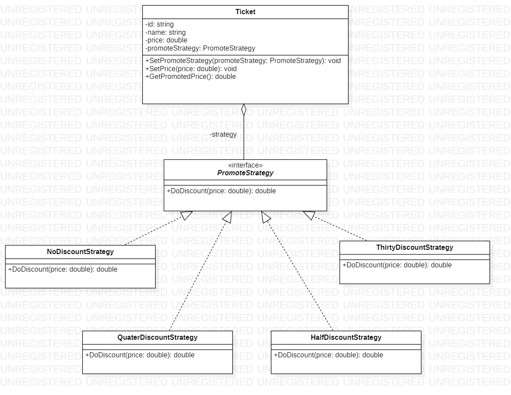
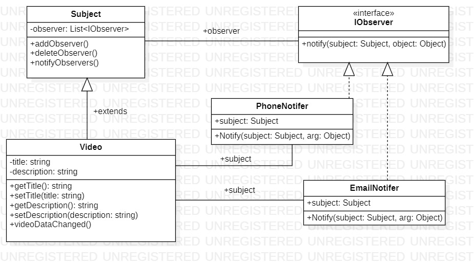
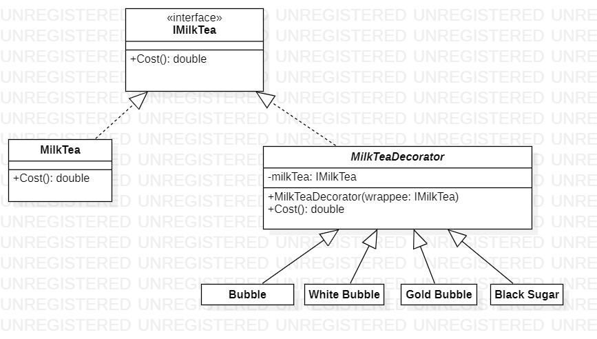

# Learning Design Pattern

## 1.Strategy

Case: Has discount price strategy for Transport Ticket

## 2.Observer

## 3.Singleton

Best Singleton Use cases:

1.  Global resource (Cac tai nguyen toan cuc)
2.  Setting in the application (Cac cai dat trong ung dung)
3.  Save application behavior (logging) (Luu hanh vi ung dung)
4.  Caching (cache) (Luu bo nho dem)

## 4.Decorator

### Tóm tắt:

- Decorator là cách để chúng ta thêm các hành vi của một đối tượng trong runtime nhưng vẫn giữ nguyên đối tượng.
- Ví dụ như khi ta đi mua trà sữa, chúng ta muốn mua món Trà sữa chocolate bạc hà trân châu trắng trân châu đen thì người ta sẽ tính tiền như thế nào?
- Giống như trong lập trình, nếu chúng ta sử dụng kế thừa bình thường và phải đáp ứng một đối tượng phức tạp, thay vì tạo các class lớn và có khả năng bị trùng code hoặc mang lại khó khăn cho việc bảo trì sau này. Chúng ta có thể sử dụng Decorator để tách những phần nhỏ ra và thêm vào nếu muốn trong runtime vì ta (không muốn hoặc không thể) (làm phình hoặc thay đổi) class khi compile.

